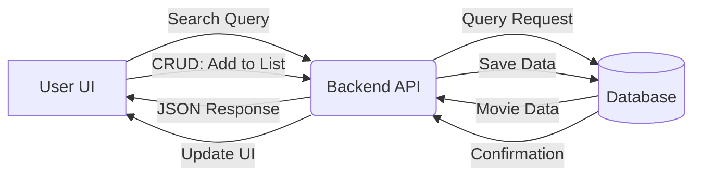

# Netflix Clone (Capstone) 🎥

A "boiled down" version of a popular streaming platform, developed as part of the Web Development Capstone Course. This project demonstrates a fully integrated full-stack application featuring a dynamic movie discovery interface and a personalized user experience.

## 👥 Contributors
- **Aayush** - [AayushCode24-7](https://github.com/AayushCode24-7)
- **Aditya** - [adityasyantaxerror](https://github.com/adityasyantaxerror)

## 🚀 Features
- **CRUD Operations:** Create, view, update, and delete items in your personal "Watchlist".
- **Search and Filter:** Dynamic search bar and genre-based filtering to navigate the movie library.
- **Data Validation:** Secure handling of user inputs and API requests to ensure data integrity.
- **Responsive Design:** Mobile-first UI that adapts across all screen sizes.
- **Full Stack Integration:** Seamless connection between the frontend UI and backend database.

## 🛠️ Tech Stack
* **Frontend:** HTML5, CSS3, JavaScript
* **Backend:** [Flask.py]
* **Database:**[]

## 🌐 Architecture & Flow

## 📂 Project Structure
```netflix-clone/
├── backend/
│   ├── app.py
│   ├── models.py
│   ├── routes.py
│   └── requirements.txt
├── frontend/
│   ├── index.html
│   ├── styles.css
│   └── script.js
├── README.md
└── .gitignore
```