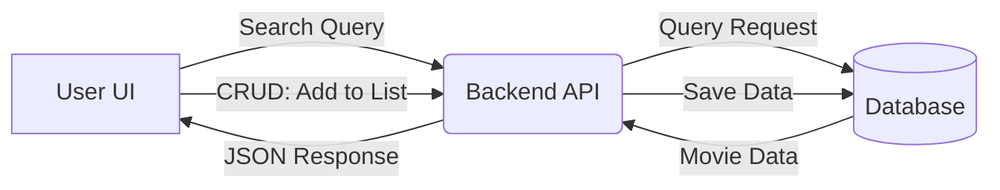

<h1><b>Project Title: Netflix Clone (Capstone)🎥 </b></h1>

Project Overview: This project is a "boiled down" version of a popular streaming platform, developed as part of the Web Development Capstone Course. Our goal is to demonstrate a fully integrated full-stack application featuring a dynamic movie discovery interface and a personalized user experience.

<b><h1>👥 Contributors</b></h1>
Aayush - Aditya  
[AayushCode24-7] - [adityasyantaxerror]

<h1><b>🚀 Features (Core Requirements)</b></h1>

<h3><b>This project includes:</b></h3>

CRUD Operations: Users can create, view, update, and delete items in their personal "Watchlist". 
Search and Filter: A dynamic search bar and genre-based filtering system to navigate the movie library. 
Data Validation: Secure handling of user inputs and API requests to ensure data integrity. 
Responsive Design: A mobile-first UI that adapts across all screen sizes. 
Full Stack Integration: A seamless connection between the frontend UI and backend database. 

<h1>🛠️ Tech Stack</h1>
Frontend: HTML5, CSS3, JavaScript

<h1>🌐 Live Demo/Flow Chart </h1>
<ul>
    <li>FrontEnd:</li>
    <li>BackEnd:</li>
</ul>
<h1>Flow Chart</h1> 

